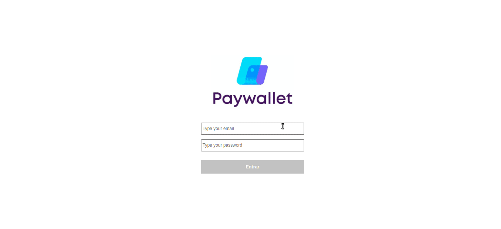

# About the project / *Sobre o projeto*

This project is a virtual wallet to store the user's financial data.

*Esse projeto é uma carteira virtual para armazenar os dados financeiros do usuário.*

---
# Skills / *Habilidades*

 - HTML, CSS, Javascript
 - React
 - Redux (store/reducers)
 - Local Storage

---
# Layout

---
# Deployment / *Implantação*

See it in action/ **Veja em ação**: [https://kelsonbatista.github.io/project-paywallet/](https://kelsonbatista.github.io/project-paywallet/)
